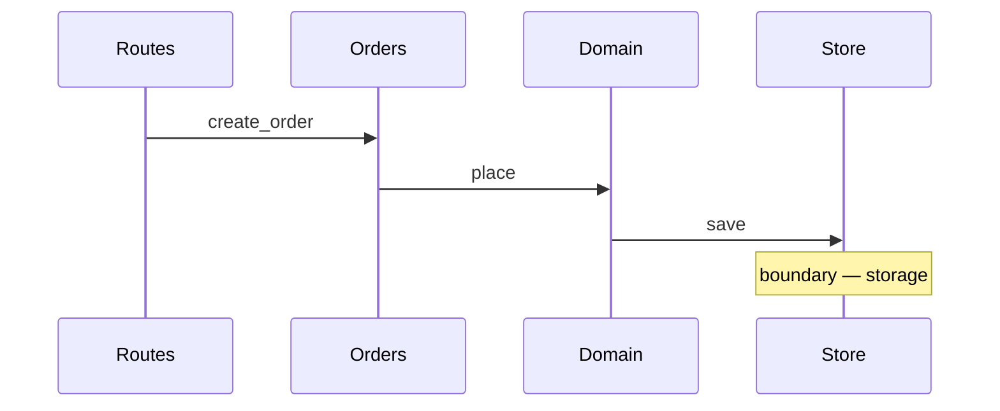

# Trace

One action, one path, every hop cited. The output is an ordered list of
locations and a sequence diagram built from it.

## 1. Pin the action

A trace is only as precise as its starting point. Before reading anything, the
action must have a **trigger** and an **effect**: what starts it, and what has
happened once it is done.

"How does authentication work" cannot be traced. "What happens between a sign-in
request arriving and a session being stored" can.

If the request is not yet in that form, ask for the missing half. Do not pick
one and proceed; a trace of the wrong action reads exactly like a trace of the
right one.

## 2. Find the entry point

```sh
kyrio repo map
```

Returns the layout and the entry points it detected, which is usually enough to
know where a trigger of this kind is registered.

Then search for the trigger itself. Two directions, chosen by the question:

- **Outside in**, when the trigger is external — a route table, an argument
  parser, an event or message subscription, a scheduled job. Start where the
  outside world is admitted.
- **Inside out**, when the question is about a value or a symbol. Start at the
  symbol and find its callers.

Say which entry point you chose and how you found it. If nothing plausible
turns up, stop and report what was searched for. A guessed entry point makes
every hop after it fiction.

## 3. Follow one path

At each hop, record four things:

- `path:line`
- what happens there, in one clause
- what it calls next
- how you know — the line that proves the call

Then move to the next hop, and only the next hop.

**Every hop needs evidence.** A trace that reads well but whose third and
fourth steps are not actually connected is worse than no trace: it is
confidently wrong, and it will be acted on. If you cannot point at the line
that makes the call, the chain is broken — say so rather than bridging it.

**Branches are noted, not followed.** Where the path forks — an error route, a
cache hit, a second implementation — name the fork in one line and continue on
the path being traced. Following both is a survey.

**Where the static chain breaks**, which is normal in code using interfaces,
dependency injection, an event bus, registration tables, or reflection: say it
broke, say what you searched for, and resolve it by finding the registration or
binding. If it cannot be resolved, mark the hop unresolved and carry on from the
other side. Do not select the implementation that looks most likely.

## 4. Stop at the boundary

The trace ends where control leaves the code being read:

- a network call
- a write to or read from storage
- a message published to a queue
- a hand-off into a framework or third-party library

Name the boundary and what crosses it. Do not describe what happens on the far
side, and do not follow the path into framework internals.

If the chain is still running after roughly fifteen hops, the action was too
large. Report the path so far, name where it was cut, and say what a narrower
action would be.

## 5. Report

Two artifacts, in this order.

**The ordered path.** One line per hop:

```text
1  src/intake/routes.py:88     submission accepted, calls create_order
2  src/intake/orders.py:24     validates the payload, calls OrderService.place
3  src/domain/order.py:140     builds the record, calls repository.save
4  src/store/orders.py:57      writes the row — boundary, storage
```

Mark unresolved hops in place rather than omitting them.

**The sequence diagram**, built from that list and nothing else, so the two
cannot disagree:



Participants are modules, not classes. Show the return path only where the
caller does something with what comes back.

Close with the branches that were noted and not followed, and any hop left
unresolved. Those two lists are the honest edge of the trace.

## Bounds

- One action per run. A second action is a second run.
- Read the region around each hop, not whole files.
- Do not say what the code should have been. This is comprehension, not review.
- Write nothing, and change nothing.
- For the shape of a whole repository rather than one path through it, use
  `/kyrio:orient`.
